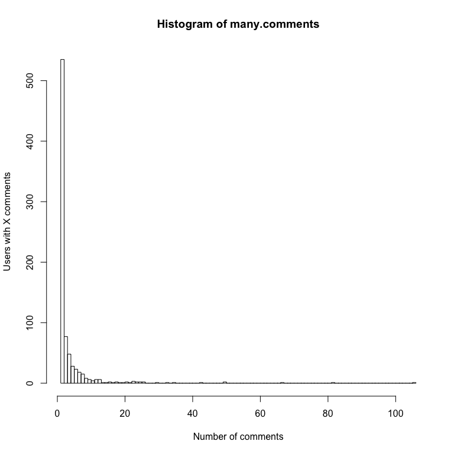
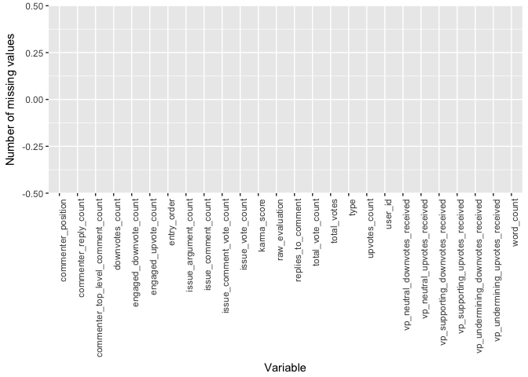

YourView preliminary data analysis
================
Lizzie Silver
07/09/2017

Goals:
------

1.  recreate James' analytic pipeline from Chris' pre-prepared data table
    -   Random forest model to predict comment critical thinking score from features of comments and comment authors
    -   Cross validate, splitting by user

2.  look at how Chris pulled the data
    -   see why there are so many NA values
    -   create new SQL query to extract comment stats

### Preparation

Load required libraries:

``` r
library(RPostgreSQL)
library(ranger) # for random forests
library(jsonlite)
library(caret)
library(ggplot2)
```

Set up DB connection:

``` r
# read DB config file (username, password etc.)
confile <- "~/yourview/config.json"
config <- fromJSON(readLines(confile))

# create a connection to the postgres database
drv <- dbDriver("PostgreSQL")
con <- dbConnect(drv, dbname = config$database,
                 host = config$host, port = config$port,
                 user = config$username, password = config$password)
```

Load data:

``` r
# read Chris' SQL query, use it to load the comments data frame from the DB
fileName <- '~/Documents/2017-02_YourView_data_extraction/comments.sql'
comments.query <- readChar(fileName, file.info(fileName)$size)
comments.df <- dbGetQuery(con, comments.query)

# these are the variables James used in his analysis. 
selected.vars <- c("user_id",
                   "commenter_credibility",
                   "commenter_top_level_comment_count", 
                   "commenter_reply_count", 
                   "issue_vote_count", 
                   "issue_comment_vote_count", 
                   "issue_comment_count", 
                   "issue_argument_count", 
                   "word_count", 
                   "entry_order", # nb: James' data said "entry_order_in_issue"
                   "entry_order_in_thread", 
                   "argument_entry_order", 
                   "upvotes_count", 
                   "downvotes_count", 
                   "karma_score", 
                   "total_vote_count", 
                   "vp_supporting_upvotes_received", 
                   "vp_neutral_upvotes_received", 
                   "vp_undermining_upvotes_received", 
                   "vp_supporting_downvotes_received", 
                   "vp_neutral_downvotes_received", 
                   "vp_undermining_downvotes_received", 
                   "total_votes", 
                   "commenter_position", 
                   "type",
                   "engaged_upvote_count", 
                   "engaged_downvote_count", 
                   "raw_evaluation")

comments.df2 <- comments.df[, selected.vars]
```

Check out the distribution of comments per user. Note there are a few users with many comments

``` r
many.comments <- table(comments.df$user_id)
hist(many.comments, breaks=100, xlab="Number of comments", ylab="Users with X comments")
```



Check number of NAs in each column. Some columns have lots!

``` r
numnas <- function(x) sum(is.na(x))
na.sum <- apply(comments.df2, 2, numnas)
plotnas <- data.frame(na.sum)
plotnas$var <- rownames(plotnas)
ggplot(plotnas, aes(plotnas$var,plotnas$na.sum)) + 
  geom_bar(stat="identity") + 
  theme(axis.text.x=element_text(angle=90, hjust=1)) +
  labs(x="Variable", y="Number of missing values")
```



Remove columns with lots of NAs, then remove rows with NAs remaining

``` r
# select the vars with fewer than 10% NAs
few.nas <- selected.vars[na.sum <= nrow(comments.df2)/10]
comments.df2 <- comments.df2[, few.nas]

# delete remaining rows with any NAs
na.sum <- apply(comments.df2, 1, numnas)
comments.df2 <- comments.df2[na.sum==0, ]
```

### Model building

Split up USERS into ten groups, and use those to partition comments

``` r
users <- unique(comments.df2$user_id)
# note that createFolds returns a list of *indices* of user IDs.
flds <- createFolds(users, k = 10, list = TRUE, returnTrain = FALSE)
# fld holds the "fold number" of each comment
fld <- vector(mode="numeric", length=nrow(comments.df2))
for (i in 1:10) {
  fld[which(comments.df2$user_id %in% users[flds[[i]]])] <- i
}
```

For each of the 10 folds, build a random forest using 90% of the data, and use that to predict evaluation scores for the remaining 10% of the data.

``` r
# create empty vector to hold the predicitons
predicted <- vector(mode="numeric", length=nrow(comments.df2))

for (i in 1:10) {
  # build training set and test set
  train.set <- fld %in% setdiff(1:10, i)
  test.set <- fld == i
  
  # build random forest using ranger package, on training data
  forest <- ranger(raw_evaluation ~ ., comments.df2[train.set, ])
  
  # save predictions on the test set
  test.pred <-  predict(forest, subset(comments.df2, subset=test.set, 
                                                select=-c(raw_evaluation)))
  predicted[test.set] <- test.pred$predictions
}
```

### Evaluation

Correlation between predicted and true values

``` r
cor(comments.df2$raw_evaluation, predicted)
```

    ## [1] 0.693446

TODO
====

-   better evaluation of the model
-   repeat multiple times and average results
-   set seed for reproducible results
-   check folds for how even/uneven the group sizes are?
-   down-weight comments by prolific users

NOTES
-----

### PROBLEM 1: many comments made by a small number of users!

1.  how to handle this when splitting the data into train and test sets?
2.  would not want small number of users to have undue leverage over results

#### options:

-   subsample data when splitting into train & test sets
-   downweight comments from users with lots of comments

Note that: \* the randomForest package does not allow you to weight *cases*. \* The ranger package allows this. \* But the ranger package does not have a method for imputing missing data.

### PROBLEM 2: I don't like any of R's methods for dealing with missing data in a random forest context.

Weka handles this by splitting the cases with missing values into "fractional instances". See: <http://weka.8497.n7.nabble.com/random-forest-and-missing-values-td30476.html>

in R, you can impute values, drop cases with missing values, or drop vars.

For now, I'll just drop vars and cases, but I'll come back to this.
